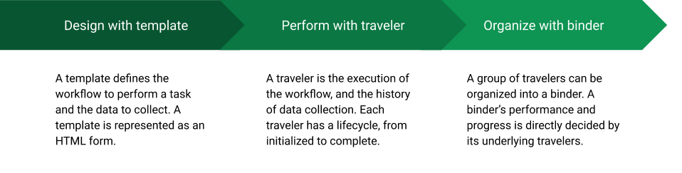

## Basics

**Audience: all users**

The [travelers](#traveler) are electronic documents created from predefined
[templates](#form). A traveler lists the tasks in order to finish the work
defined by the released work template. The user records data and notes when
performing the tasks. Travelers can be grouped into working packages named
[binders](#binder).

Besides web based user interface, the traveler application provides a simple
HTTP [API](#api) for other applications to operate templates, travelers, and
binders.

### What is a template?

A template is the documentation for a predefined process. A user can execute the
process multiple times and collect data during the executions. A template can
contain multiple sequenced sections, and each section can contain instructions
and inputs.

A user can design a template in a WYSIWYG (what you see is what you get) editor.
Each template has a life cycle, and can be managed by users. Users can only
create travelers from the **released** templates. The
[draft templates section](#draft-template) describes the details of how to work
with templates.

There are two types of templates --- normal templates and discrepancy templates.
A normal template defines a sequence of actions and data points to collect. A
discrepancy template was designed for for QA process, in which the data
collected in a normal process is examined and requested for correction. A normal
template can be used on its own, while a discrepancy template has to be used
together with a normal template.

### What is a traveler?

A traveler is an electrical document that supports the execution of a predefined
process in a released template and to collect user input data and notes in the
process. It also supports collections of discrepancy QA logs when a discrepancy
template is used.

A traveler has properties like title, description, deadline, locations, devices,
and tags. The user can add/remove multiple tags into the tag list. Tags can be
used to group and find travelers. A device is a special type of tag that
represents a physical entity related to the traveler. The user creates a new
traveler when **initializing** it from a **released** template. Its state can be
changed to **active**, **submitted for completion**, **completed**, and
**frozen**. A traveler, either finished or not, can be **archived** when it
needs no more attention from users. Only the traveler owner can access the
traveler when it is archived. A traveler owner can
[share](#ownership-roles-and-access-control) her/his traveler with other
users/groups. A user can also [transfer](#ownership-roles-and-access-control)
the ownership of a traveler to another user if that feature is enabled in the
application.

The users with written permission to a traveler can input values into an
**active** traveler. The input **history** is kept with the traveler. Each input
can also have user notes attached to it. Optionally, a traveler can contain the
history of discrepancies. A traveler can be considered as the composition of a
released form/template, the input data, the notes, and discrepancy logs (if
applied):

**traveler = template + data + notes [+ discrepancy logs]**

The [travelers section](#travelers) provides more detailed information about how
to create, update, and manage travelers.

### What is a binder?

A binder is a collection of works that a user puts together for easy management.
The traveler is a typical type of work. It is like a virtual folder containing
the works related to a specific topic. For example, an engineer can put all the
travelers related to a specific device into one binder. A workshop manager can
put all the travelers involved in the workshop into one binder. One traveler can
be put into multiple binders.

### Log in and out

Besides this document page and the main page, all other resources are only
accessible to **authenticated** users. Users can use their organization username
and password to log in. Users are encouraged to log out when they do not work
with the application. If not log out, a user's session will expire after a
period. When a user tries to access a resource URL on a browser with an expired
session, the user will be directed to the login page, and be redirected back to
the requested URL if login succeeds.

When a page contains unsaved content and the session has expired, an error
message will appear on the top of the page when the user tries to save. Log in
the application in a **new** tab or page, and then save the change again. Do not
close or navigate away from the page that contains the unsaved changes,
otherwise the unsaved changes will be lost.

### Ownership, roles, and access control

The traveler application supports **role/permission based** and **attribute
based** access control. When a user tries to access a resource, both the user's
roles and permissions in the current session and the resource's access related
attributes are considered. The access is granted if either the role or the
attribute allows.

There are three built-in roles, admin, manager, and reviewer, which can be
mapped to predefined permissions. The roles and role-to-permission mapping are
configurable in the traveler application. A user can be associated with multiple
roles, therefore the permissions mapped from those roles.

The traveler application has four important entity types: draft template,
released template, traveler, and binder. Each type has three attributes to
control the access, the ownership, sharing, and public accessibility (if enabled
in the configuration).

There are three levels of access privileges: no access, read, and write. The
details are listed in the following table.

| access privilege | details                                                                         |
| ---------------- | ------------------------------------------------------------------------------- |
| no access        | rejected when requesting to access an entity                                    |
| read             | view the representation of an entity, but will not be able to modify the entity |
| write            | be able to view and modify the entity                                           |

Every entity has an owner. The initial **owner** is the user who creates the
entity. An entity's ownership can be transferred to a different user by its
current owner or by an admin user who has the required permission. The owner, by
default, has the privilege to configure attributes of the entity including the
sharing and public accessibility. Ownership transfer is a configurable feature.

### Tabs and tables

The templates, travelers, and binders pages use tabs to separate entities in
different statuses. In each tab, the entities are listed in a table. There are
two places that a button can be placed on a tabbed page. On each list page, when
a button is located on top of the tabs, the button's action is applicable to all
the tabs and tables inside the tabs. When a button is located **inside** a tab,
then the button's action is only applicable to that tab and table.

Around a table, there are 6 areas each of which either hold optional tools or
display information.

| area | location     | content                                                             |
| ---- | ------------ | ------------------------------------------------------------------- |
| 1    | top left     | a select input to change the number of records shown per table page |
| 2    | top middle   | show a message when the data inside the table is in processing      |
| 3    | top right    | a text input to filter all the columns in the table                 |
| 4    | bottom row   | text inputs to filter the corresponding table column                |
| 5    | bottom left  | the numbers of entries out of the total number shown in the view    |
| 6    | bottom right | pagination controls                                                 |

### Print

In most cases, the user can print the page to either PDF or a real printer with
the browser's print function. The traveler pages have a dedicated view to be
print format friendly. On a traveler page, clicking on the
<button class="btn btn-primary">Create PDF</button> button will open a new tab
of the print view. On the print view, the user can use the top toggles to show
or hide the validation, notes, and details information.

The traveler report page loads the table view of the data inside a group of
travelers. The user can generate a PDF file or print the table with the tools on
the page directly.

### Colors and graphical design

The traveler application uses a color convention in the interface design. The
buttons are colored according to the possible impact of the actions.

<button class="btn btn-primary">primary</button>

<button class="btn btn-info">information</button>

<button class="btn btn-success">success</button>

<button class="btn btn-warning">warning</button>

<button class="btn btn-danger">danger</button>

Each traveler or binder has an estimated progress. The progress is visualized by
a bar. The bar color and corresponding entity status is listed in the following
table.

| progress bar | status |
| -------------| -----------|
| 

0 / 7

 | initialized |
| 

2 / 7

 | active |
| 

6 / 7

 | submitted for completion approval or frozen |
| 

 | approved completion |

 

Some progress bars have values on it. The formats of the value notations are
listed in the following table.

| entity type | progress bar | values |
| ----------- | ------------ | ------ |
| traveler | 

2 / 7

 | updated input number / total input number |
| binder or entity in a binder | 

0 + 3 / 10

 | finished value + in-progress value / total value |

 

In a binder, a colored flag denotes the status of a work.

| flag | status |
| -------------| -----------|
| <i class="fa fa-flag fa-lg text-info"></i> | going well |
| <i class="fa fa-flag fa-lg text-warning"></i> | not going well |
| <i class="fa fa-flag fa-lg text-success"></i> | completed |
| <i class="fa fa-flag fa-lg text-error"></i> | failure |
| <i class="fa fa-flag fa-lg black"></i> | not active |
