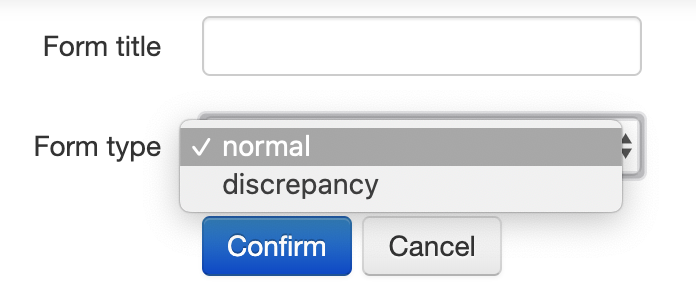
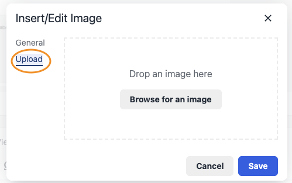
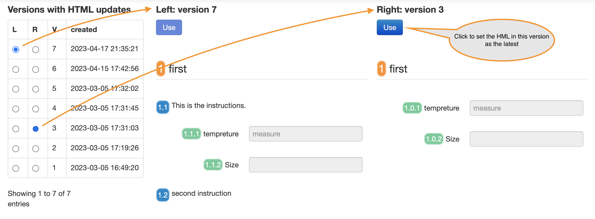

## Draft template

**Audience: traveler users, especially process template owner**

Before creating travelers, a user needs to design a template and release it after a review process. A traveler template mimics the paper traveler so that a process owner defines the sequence of actions and specifies the data to be collected in each step.

### Normal templates

Most traveler use cases can be covered with normal templates. The user can
define most common HTML input types, including numbers, date, short text, long
text, radio button, checkbox, and file upload in a normal template. The user can
also include instructive directions of text, diagrams, and formulas in a normal
template. A normal template supports numbered sections for easy navigation and
reference.

### Discrepancy template

A discrepancy template can be used for a quality assurance (QA) like process. It
is owned by the QA process owner, who has the responsibility to verify the
result of a traveler. When a traveler is ready for quality assurance, a QA
personal will check if the result meets the expectation. A discrepancy is logged
if the work does not pass QA, which will be followed by a correction. The
correction will be recorded in the traveler with data updates. Then a new QA
iteration can be triggered.

A released discrepancy template cannot used solely without being attached to a
released normal template when creating a traveler.

### States and life cycle of a template

The following diagram shows the state transition of a template and a released
template.


There are two groups of templates: draft and released. Only a released template
can be used to create a traveler. The traveler application supports the review
and approval process of templates.

A template is a draft and editable when created. When a draft template is not
needed any more, it can be archived.

When a draft template is ready for review, its owner can request one or more
reviewers to check if the template is ready to release. A reviewer can either
approve or request for change. When any reviewer requests a change, the review
process ends and the form becomes editable. All the reviewers must approve
before a template can be released.

When a template is released after a review process, a new released template is
created. A released template can be archived. A released template can be updated
by reversion. When a reversion starts, no traveler can be created from the old
released template. The original draft template becomes editable, from where a
new released template version can be created after a new review process.

### Tabs on the template page

**Note: this section depends on configuration**

The templates are listed in different tabs according to their status. Please
click the tab to see what are the content to be included in each tab.

<div>
<ul class="nav nav-tabs"><li class="active"><a href="#forms" data-toggle="tab">Draft templates</a></li><li><a href="#submittedforms" data-toggle="tab">Under review templates</a></li></ul>
<div class="tab-content well">
<div id="forms" class="tab-pane active">All draft templates</div>
<div id="submittedforms" class="tab-pane">All draft templates under review</div>
</div>
</div>

### Template builder

The template builder is a what-you-see-is-what-you-get editor. It is the
starting point to use the traveler application for most users.

#### Template type

**Note: this section depends on configuration**

Log in the traveler application, and navigate to the <a href="/forms/">Forms or
Templates</a> page. Then click the <a id="new" href="/forms/new" target="_blank"
data-toggle="tooltip" title="create new empty forms" class="btn btn-primary"><i
class="fa fa-file-o fa-lg"></i>&nbsp;New form</a> button.

A new page will load the following page.



The user needs to set the new template's name, and choose the type. The default
type is [normal](#normal-templates). The [discrepancy](#discrepancy-template) type is for QA
process in order to check the discrepancy of a work. Click <button
class="btn btn-primary">Confirm</button> to go to next step. Always start with
the normal type for your first try.

#### Template components

**Note: this section depends on configuration**

A new template has no inputs inside. The user can add new components, update the
attributes of an existing component, duplicate a component, and adjust the
location of a component.

##### Basic input components

The template builder support 8 basic inputs types:

<!-- prettier-ignore -->
| input name | usage | properties |
| ----------- | ----------- | ----------- |
| Checkbox | specify a boolean value, true or false | Label, User defined key, Text, Required |
| Checkbox set | select any number out of multiple options | Set label, User defined key and Text for each option |
| Radio | choose one out of multiple options | Label, User defined key, Text, Required, Radio button value |
| Text | a single line text to record  | Label, User defined key, Placeholder, Required, Help  |
| Figure | not a user input, a visual instruction for traveler user | Select an image, Image alternate text, Width, Figure caption |
| Paragraph | multiple line text to record | Label, User defined key, Placeholder, Row Required, Help |
| Number | either an integer or a float value | Label, User defined key, Placeholder, Help, Min, Max, Required |
| Upload file | use upload file | Label, User defined key, Help, Required |
| Other types | Text/Number/Date/Date Time/Email/Phone number/Time/URL HTML5 input types with validation support | Label, User defined key, Placeholder, Help, Required |

<br>
Each input is specified by a list of properties. Some properties control the input
presentation, and some control its behavior, and some are for internal traveler
application. The details of the input properties are listed in the following
table.
<br>

<!-- prettier-ignore -->
| property name | usage | notes |
| ------- | ------ |  -------- |
| Label | appears in front of the input, short description | default as "label", SHOULD be short and unique in the template |
| User defined key  | does not render in the template, but used for report and API | MUST be unique within the template; **only** letter, number, and "\_" allowed (Example: MagMeas_1) |
| Radio button value | appears behind the radio button | the value will be recorded in DB; each radio button value MUST be unique within the radio group |
| Required | whether the input is required | when an input is required, the value MUST be present to pass template validation; for checkbox, required means it MUST be checked |
| Placeholder  | appears inside the input before the user touches | a short hint to the user |
| Select an image | upload an image for the figure | choose an image file from local file system and then click upload |
| Image alternate text | the text appears in the place when the image is not loaded | meaningful text for the image |
| Width | the width of image appearing in the template | when the image is too large, use this property to resize it. The unit is pixel, and the height will be adjusted accordingly to keep the original aspect. |
| Figure caption | appears below the image | a long text to describe the image |
| Row  | the number of rows for the text box | provide enough space so that the user can input or view the text without scrolling |
| Min | minimum allowed value for a number | useful for validation |
| Max | minimum allowed value for a number | useful for validation |
| Help | appear below the input | a long hint to the user for the input |

##### A note on multiple choice input in HTML

The `select` element with `multiple` attribute of true was designed to implement
a multiple choice in HTML as in
[rfc1866](https://datatracker.ietf.org/doc/html/rfc1866#section-8.1.3). However,
a user can face various challenges when interacting with it. On a desktop
device, a user needs to hold a special key while using mouse to click on
options. On a mobile device, a user needs to click on the element in order to
reveal the options.

Many find that a set of checkbox input has a better user experience, like
[this example on MDN](https://developer.mozilla.org/en-US/docs/Web/HTML/Element/input/checkbox#try_it).
We use checkboxes to implement multiple choice in the traveler form builder.

##### Advanced components

Currently, the builder supports two advanced controls, section and rich
instruction. The section is for easy navigation and reference of a traveler.
When a template has sections, a floating navigation will be generated on the
right side of the traveler page. With the navigation, the user can jump to a
section with a click. This is helpful when a template is several pages long.

With rich instruction, a user can add math formulas, web links, images, tables,
and other rich component. This is useful when the user needs a rich format
editor to compose the paragraph.

Two types of images can be added into a template, 1) a self-hosted image that is
uploaded from a user's local disk and saved on traveler server, and 2) an image
that is hosted on an website that the users have access. Option 1) is
recommended in order to have full control of the image.



#### Update, delete, or duplicate a component

When hovering on an existing template component, the component will be focused
and a set of buttons shows on the top right corner of the component as follows.

<div
class="btn-group"><a data-toggle="tooltip" title="edit" class="btn btn-info"><i
class="fa fa-edit fa-lg"></i></a><a data-toggle="tooltip" title="duplicate"
class="btn btn-info"><i class="fa fa-copy fa-lg"></i></a><a
data-toggle="tooltip" title="remove" class="btn btn-warning"><i class="fa
fa-trash-o fa-lg"></i></a></div>

The first button is to show or hide the attribute panel for the component. The
second is to create a new component same to the current component. The third is
to remove the current component from the template.

#### Save changes

Whenever you update the template by adding a new input, or updating an input's
attributes, or adjusting the locations of the inputs, you can save the change to
the server by clicking the <button class="btn btn-primary">Save</button> button.

When the user tries to save a template, the builder checks if a component's
editor is still open. If it is, then the user will see an alert to finish the
edit first. The user can either commit the change by clicking the
<button class="btn btn-primary">Done</button> button, or cancel the change by
clicking the <a data-toggle="tooltip" title="edit" class="btn btn-info"><i
class="fa fa-edit fa-lg"></i></a> button again.

#### Sequence number

**Note: this section depends on configuration**

Sequence numbers are added automatically to the components. There are three
levels of numbers: the section is the top level, the second is the rich
instruction, and the third is the basic input.

```
1 Section name
1.1 instruction for what to do
1.1.1 some data to collect
```

When a new component is added, or a component's location is adjusted, the
numbers are updated automatically. For the templates created with an older
version of the builder, there might not be numbers. The user can generate the
numbers by clicking the <button class="btn btn-primary">Generate
numbering</button> button.

A sections and elements inside a template can be automatically numbered. Or the
user can specify the numbers manually. When the auto numbering feature is
disabled, a set of four buttons shows when hovering on a template component.

<div class="btn-group"><a data-toggle="tooltip" title="number" class="btn btn-info"><i class="fa fa-sort-numeric-asc fa-lg"></i></a><a data-toggle="tooltip" title="edit" class="btn btn-primary"><i class="fa fa-edit fa-lg"></i></a><a data-toggle="tooltip" title="duplicate" class="btn btn-info"><i class="fa fa-copy fa-lg"></i></a><a data-toggle="tooltip" title="remove" class="btn btn-warning"><i class="fa fa-trash-o fa-lg"></i></a></div>

Click the first button on the left to set the number of the current element.

#### Adjust component location

**Note: this section depends on configuration**

Click the <button class="btn">Adjust location</button> to enter the location
adjustment mode. The user can drag and drop a component to a different place.
The sequence number will be updated every time a component's location is
changed. Click the <button class="btn">Done</button> to exit the location
adjustment mode. Note that the changes will not be saved until clicking the
<button class="btn btn-primary">Save</button> button.

#### Import other templates

In order to make the composition of a new template fast, the user can import the
components inside any draft template or released template into the current
builder. After importing, the user can adjust the location or remove components.

#### Preview and validation

The user can preview the saved template any time when clicking the <button
class="btn btn-info">Preview</button> button. The preview page renders the
template and the validation logic specified in the builder. The user can see the
validation result when clicking the <button class="btn btn-info">Show
validation</button> button.

#### Save as a new template

The user can save the template in the builder as a new template. The new
template can be found in the my draft templates list.

### Clone a template


### Ownership transfer


### Template version control

When a watched property of a template is updated on the server (the user clicks
the save button), the template version will be incremented. The watched
properties include the title, description, and HTML. The template viewer or
builder always renders the latest version when refreshed.

The user can view the versions with HTML changes by clicking the
<a data-toggle="tooltip" title="Check and switch versions" class="btn btn-primary">Version
control</a> button. The user can choose any two versions to compare them side by
side. Note that not all the details of template HTML are viewable when rendered,
e.g. the input validation rules like min and max value of a number. The user can
"revert" the template to an old version by clicking the
<button data-toggle="tooltip" title="Create a new version" class="btn btn-primary use">Use</button>
button. In order to record the change, a new version is created for the
template.



### Template review and release process

A traveler can only be created from a released template. A released template is
created when a draft template is approved by the reviewers and released after
that. When the owner finishes editing a template, s/he can request a template
review by click on the <button class="btn btn-primary">Submit for
review</button> button.

All the submitted templates are listed on the under review templates tab. On the
template review page, the template owner can add or remove reviewers. A reviewer
is a user with the reviewer role. When any reviewer requests change in the form,
the review process is stopped. All past review results and comments for specific
versions are viewable for future reference. The review process restarts when the
owner makes changes and submits for review again.

When all the reviewers approve the template of the current version, the <button
class="btn btn-primary">Release</button> button will appear on the template
page. When the owner releases the approved template, a new released template is
created. The approved template is listed on the approved and released template
table.

#### Reviewer

**Audience: admin and reviewer**

A normal traveler user cannot review templates. The admin needs to add the
reviewer role to the users who want to perform the task. A reviewer sees <a
href="/reviews/">Reviews</a> link on top of the traveler page. The reviews page
lists all the active templates under review. The reviewer can approve or request
for more works for a template. A template needs to be approved by all the
reviewers before release. A single rework request from any reviewer will
terminate the review process, and the template becomes editable again. A
reviewer can request change for a template that s/he has approved before it is
released by the template's owner.
