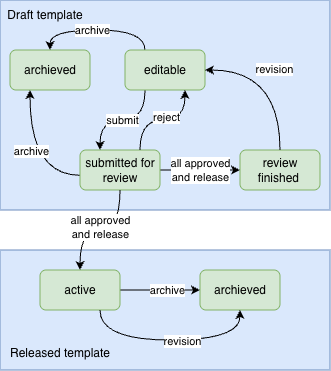

### States and life cycle of a template

The following diagram shows the state transition of a template and a released
template.

<figure align="center">

<figcaption>
States and life cycle of templates
</figcaption>
</figure>

There are two groups of templates: draft and released. Only a released template
can be used to create a traveler. The traveler application supports the review
and approval process of templates.

A template is a draft and editable when created. When a draft template is not
needed any more, it can be archived.

When a draft template is ready for review, its owner can request one or more
reviewers to check if the template is ready to release. A reviewer can either
approve or request for change. When any reviewer requests a change, the review
process ends and the form becomes editable. All the reviewers must approve
before a template can be released.

When a template is released after a review process, a new released template is
created. A released template can be archived. A released template can be updated
by reversion. When a reversion starts, no traveler can be created from the old
released template. The original draft template becomes editable, from where a
new released template version can be created after a new review process.
