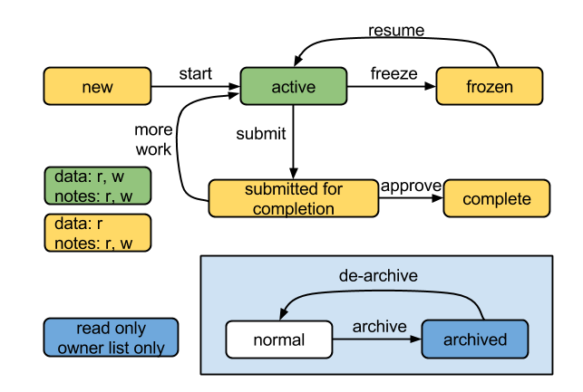

## Traveler

**Audience: traveler users**

A user can create new travelers from released templates.

The traveler owner can [configure](#configure-a-traveler), [share](#share-traveler), [active and approve the completion](#traveler-status) of a traveler. The traveler owner work with other users to input data and notes into a traveler in order to finish the task described by the traveler.

A traveler can be located by its URL. The URL is like `/travelers/longstringid/` where the `longstringid` is the traveler's unique identity. The user can bookmark the traveler's URL or send it to other users. A user needs to have at least read permission to view a traveler.

### Create a new traveler

**Audience: all who want to create a traveler**

The user can create new traveler(s) from any [released template](template.md).
Select one or more templates that you want to create new travelers, and click
the
<button id="form-travel" data-toggle="tooltip" title="create travelers from selected template" class="btn btn-primary"><i class="fa fa-plane fa-lg"></i>&nbsp;Travel</button>
button. New traveler(s) will be created and listed in the `Travelers` table with
`initialized` status.

When a traveler is created from a select released template in the list, the list
item will have a <i class="fa fa-check"></i> icon pre-appended. Otherwise, it
will be a <i class="icon-question-sign"></i> icon with error message. When the
list is finished, the page will be redirected to the traveler list page.

### Traveler status

**Audience: traveler owners and others with write permission**

The allowed access of a traveler changes with its status. The transitions
between statuses, and the allowed access at each status are shown in the
following diagram, where **r** for read and **w** for write.

The following table lists the status and corresponding allowed access for
traveler data and traveler notes.

| status                                        | artifact | allowed access    |
| --------------------------------------------- | -------- | ----------------- |
| new                                           | data     | no data available |
| new                                           | notes    | read and write    |
| active                                        | data     | read and write    |
| active                                        | notes    | read and write    |
| frozen, submitted for completion, or complete | data     | read only         |
| frozen, submitted for completion, or complete | notes    | read and write    |
| archived                                      | data     | read only         |
| archived                                      | notes    | read only         |

### Update a traveler's status

**Audience: traveler owner and other users with write permission**

A traveler's possible statuses and allowed transitions among statuses are
described in the [traveler status](#traveler-status) section.

The user can change an initial traveler's status to **active** by clicking on
the <button id="work" class="btn btn-primary">Start to work</button> button when
the traveler is ready to accept data.

The user can change an active traveler to **submitted for completion** by
clicking on the <button id="complete" class="btn btn-primary">Submit for
completion</button> button on the traveler page.

The user can change a submitted traveler to **complete** by clicking on the
<button id="approve" class="btn btn-primary">Approve completion</button> button
when the work is complete. If the work is not complete, click on the
<button id="more" class="btn btn-warning">More work</button> button to reject
the submission.

The user can change an active traveler to **frozen** by clicking on the
<button id="freeze" class="btn btn-warning">Freeze</button> button in order to
stop accepting data in the traveler. Click the
<button id="resume" class="btn btn-primary">Resume</button> button to resume
work.

### Tabs in traveler page

**Audience: traveler owners and others with write permission**

The travelers are listed in different tabs according to their status and ownership. Please click the tab to see what are the content to be included in each tab.

<ul class="nav nav-tabs"><li class="active"><a href="#travelers" data-toggle="tab">My travelers</a></li><li><a href="#transferredtravelers" data-toggle="tab">Transferred travelers</a></li><li><a href="#sharedtravelers" data-toggle="tab">Shared travelers</a></li><li><a href="#groupsharedtravelers" data-toggle="tab">Group shared travelers</a></li><li><a href="#archivedtravelers" data-toggle="tab">Archived travelers</a></li></ul>

All travelers created by the current login user

All travelers transferredd to the current login user from other users

All travelers shared with the current login user

All travelers shared with the current login user's group

All travelers owned by the current login user and archived

### View a traveler

**Audience: traveler users**

The user can directly load the traveler in the browser with a traveler's URL. If
the user has only read permission of the traveler, the browser will redirect to
a read-only view. On the travelers table, click on the
<a data-toggle="tooltip" title="go to the traveler"><i class="fa fa-edit fa-lg"></i></a>
icon in order to load the traveler page.

In a traveler page, the top line is the traveler's title. Below the title is the
traveler status, and progress. The progress tells the number of inputs updated
out of the total inputs. The numbers represent only rough progress
**estimation** of the traveler. A traveler can be complete when some inputs have
not be updated.

The <button class="btn btn-info collapsed">Details</button> button shows/hides
some detailed information of the traveler including the description, creation
user/time and last update user/time. The details information is hidden by
default.

The
<button id="show-validation" class="btn btn-info">Show
validation</button><button id="hide-validation" class="btn btn-info active">Hide
validation</button> buttons show/hide the validation information for the
traveler inputs. The validation information include a summary section shown
under the buttons, and a validation message under each input. The
[validation rules](#builder) are defined in the form that is used as the active
form.

The
<button id="show-notes" class="btn btn-info">Show
notes</button><button id="hide-notes" class="btn btn-info active">Hide
notes</button> buttons show/hide the notes under each input. The
n icon shows the number of notes.

The value displayed in an input is the latest value saved on the server. The
history of changes is shown under each input including the submitted value,
submitter id and submission time.

When a traveler has several sections, a side navigation menu is created on the
right side. When scrolling up and down the page, the section corresponding to
the content in the current view is highlighted in the navigation menu.

### Update the data

**Audience: traveler users with write permission**

In order to update the data and notes of a traveler, the user must have the
write permission of the traveler.

A traveler's data can be updated only when it is in the
[active status](#traveler-status). When the traveler is in other statuses, all
the inputs are disabled on the traveler page. Note on the traveler view page,
the user cannot update data or notes on that page even if s/he has write
permission.

When the user inputs a new value in an input, two buttons will appear on the
right side. Click the <button value="save" class="btn btn-primary">Save</button>
button to submit the change to the traveler server. Or click the
<button value="reset" class="btn">Reset</button> button to reset to the original
value. All other inputs are disable when an input is touched. If the change is
saved on the server, there will be a

<button class="close">x</button>Success

message on the top of the page. If something is wrong, then an

<button class="close">x</button>Error

message will appear.

### Update the note

**Audience: traveler users with write permission**

In order to add a new note, click the
<a class="new-note" data-toggle="tooltip" title="new note"><i class="fa fa-file-o fa-lg"></i></a>
icon under an input. Click the n icon to show/hide the
notes, where `n` is the total number of notes, and `0` at the beginning.

When the notes are shown, hove over a note, and <a data-toggle="tooltip" title="edit" class="btn btn-info"><i class="fa fa-edit fa-lg"></i></a> will appear. Click the button to load the update modal. The modal has a text area with the current note content. Update the content, and click the <button value="update" class="btn btn-primary" data-dismiss="modal">Update</button> button to save the change.

Click the <button value="delete" class="btn btn-warning" data-dismiss="modal">Delete</button> button to delete the note. Click the <button data-dismiss="modal" aria-hidden="true" class="btn">Cancel</button> button to dismiss the modal without any change.

Only the note's author or admin/manager can update or delete a note.

### Configure a traveler

**Audience: traveler owner**

The traveler owner has the permission to configure a traveler. The configuration
options include

- traveler title
- traveler description
- deadline
- tags
- forms
- status

Click the
<a data-toggle="tooltip" title="config the traveler"><i class="fa fa-gear fa-lg"></i></a>
icon on the traveler list table in order to navigate to the traveler configuration page. On the
configuration page, click on the <button class="btn btn-primary">Edit</button>
button to update the traveler title or description. The deadline is a date
picker. Click the <button id="add" class="btn btn-primary">Add part numbers</button>
button to add a tag. If the traveler has a list of tags, click the
<button class="btn btn-small btn-warning removeDevice"><i class="fa fa-trash-o fa-lg"></i></button>
button behind a tag to remove it.

### Manage templates in a traveler (deprecated)

This feature was **removed** after we implemented a template release process.
The rational is that we should not change the traveler specification (templates)
once it is executed in the field. If there is any change to the template, there
should be a new traveler based on a new released template.
