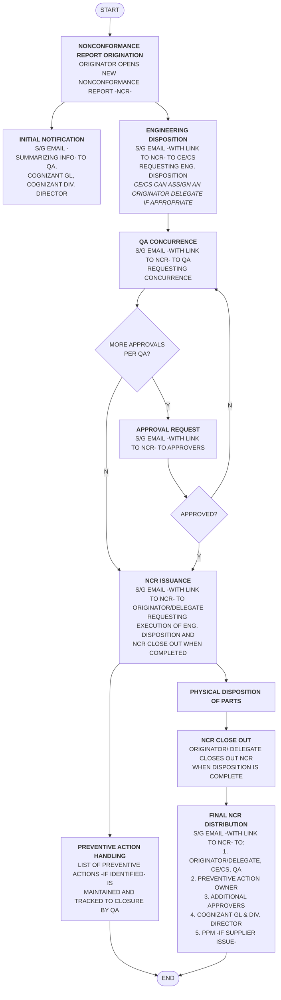

```mermaid
flowchart TD
    Start([START]) --> Origination[<b>NONCONFORMANCE REPORT ORIGINATION</b><br/>ORIGINATOR OPENS NEW NONCONFORMANCE REPORT -NCR-]

    Origination --> InitialNotification[<b>INITIAL NOTIFICATION</b><br/>S/G EMAIL -SUMMARIZING INFO- TO QA,<br/>COGNIZANT GL, COGNIZANT DIV. DIRECTOR]

    Origination --> EngDisposition[<b>ENGINEERING DISPOSITION</b><br/>S/G EMAIL -WITH LINK TO NCR- TO CE/CS<br/>REQUESTING ENG. DISPOSITION<br/><i>CE/CS CAN ASSIGN AN ORIGINATOR DELEGATE IF APPROPRIATE</i>]

    EngDisposition --> QAConcurrence[<b>QA CONCURRENCE</b><br/>S/G EMAIL -WITH LINK TO NCR- TO QA<br/>REQUESTING CONCURRENCE]

    QAConcurrence --> MoreApprovals{MORE APPROVALS<br/>PER QA?}

    MoreApprovals -- Y --> ApprovalReq[<b>APPROVAL REQUEST</b><br/>S/G EMAIL -WITH LINK TO NCR- TO APPROVERS]

    ApprovalReq --> Approved{APPROVED?}

    Approved -- N --> QAConcurrence

    MoreApprovals -- N --> Issuance
    Approved -- Y --> Issuance[<b>NCR ISSUANCE</b><br/>S/G EMAIL -WITH LINK TO NCR- TO ORIGINATOR/DELEGATE<br/>REQUESTING EXECUTION OF ENG. DISPOSITION AND<br/>NCR CLOSE OUT WHEN COMPLETED]

    Issuance --> PrevAction[<b>PREVENTIVE ACTION HANDLING</b><br/>LIST OF PREVENTIVE ACTIONS -IF IDENTIFIED- IS<br/>MAINTAINED AND TRACKED TO CLOSURE BY QA]

    Issuance --> PhysicalDisp[<b>PHYSICAL DISPOSITION OF PARTS</b>]

    PhysicalDisp --> CloseOut[<b>NCR CLOSE OUT</b><br/>ORIGINATOR/ DELEGATE CLOSES OUT NCR<br/>WHEN DISPOSITION IS COMPLETE]

    CloseOut --> FinalDist[<b>FINAL NCR DISTRIBUTION</b><br/>S/G EMAIL -WITH LINK TO NCR- TO:<br/>1. ORIGINATOR/DELEGATE, CE/CS, QA<br/>2. PREVENTIVE ACTION OWNER<br/>3. ADDITIONAL APPROVERS<br/>4. COGNIZANT GL & DIV. DIRECTOR<br/>5. PPM -IF SUPPLIER ISSUE-]

    PrevAction --> End([END])
    FinalDist --> End
```
